<div align="center">

# MITO Agent

### 面向腾讯 Hy3 的医学科研领域适配

知识库驱动 · 医学专家反馈 · SFT · RP-GRPO · 场景验证

[](#项目思路)
[](#微调模型)
[](mito/)
[](#实际场景与落地)

<a href="#训练路线与专家标注">训练与标注</a> · <a href="#微调模型">微调模型</a> · <a href="#算法与评测">算法与评测</a> · <a href="#阶段结果">阶段结果</a> · <a href="#知识图谱与机制发现">机制发现</a> · <a href="#实际场景与落地">应用落地</a> · <a href="#代码与数据">代码与数据</a>

</div>

---

## 项目思路

**让领域小模型成为 Hy3 的专业辅助工具。** 面向腾讯 Hy3 项目，我们把医学知识、实验条件判断和工具使用经验沉淀到可独立训练的小模型中，再以结构化提示、证据核验和行动建议辅助 Hy3。Hy3 保持任务理解、统一编排与综合决策，服务端负责真实工具执行和强制规则校验。

| 领域知识如何进入模型 | 专家意见如何用于训练 | 学到的能力如何接入 Hy3 |
| :--- | :--- | :--- |
| 知识库支撑初轮领域适配与模型初稿 | 医学工作者修订 → 结构化标注 → SFT | 小模型封装为工具，提供证据提示、条件约束与行动建议 |
| 保留来源、实验条件及反向证据 | 工具示范建立起点，任务与偏好反馈进入 RL | 以真实执行与对照评测检验收益，再用于科研工作台 |

## 训练路线与专家标注

<p align="center">
  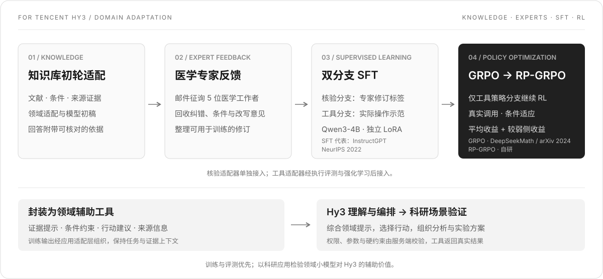
</p>

我们将知识库初轮适配后的**模型回答及其证据说明，通过邮件发送给五位医学工作者征求意见**；整理回收修订开展核验 SFT，并以工具示范和任务偏好继续训练工具策略。

| 阶段 | 我们做了什么 | 产出 |
| :--- | :--- | :--- |
| **01 · 知识库初轮适配** | 整理领域文献与实验条件，形成初轮适配结果及附证据的模型初稿 | 问题、主张、条件与证据材料 |
| **02 · 医学专家反馈** | 向五位医学工作者邮件征询，汇总回收的纠错、条件补充与改写建议 | 可采纳修订与判断依据 |
| **03 · 监督微调 SFT** | 核验分支学习修订标签和回答；工具分支学习经过执行、回放检查的操作示范 | 独立的核验适配器与工具适配器 |
| **04 · 策略强化学习** | 将可靠取证、合法调用、恰当停止及成本偏好落实为任务与奖励，比较 GRPO / RP-GRPO | 面向条件变化的工具策略 |

### 专家意见具体标注什么

| 审核内容 | 训练信号 |
| :--- | :--- |
| 证据是否真正支持主张 | 支持 / 反驳 / 不足 / 混合 |
| 物种、细胞、干预、时间和测量对象是否适用 | 条件匹配、外推与缺口 |
| 相关性是否被写成因果，结论是否过度确定 | 因果状态、不确定性、错误类型与严重度 |
| 应当怎样解释和改写 | 判定理由 `rationale` 与合格改写 `corrected_text` |

旧专家主张核验数据以问题、证据摘要、实验条件和待核验主张为输入，输出 `labels + rationale + corrected_text`。五位指邮件征询对象，公开记录仍按原有逐条来源管理；工具执行示范不标为专家亲自操作的轨迹。

### 原始工具训练数据

**构建 6,652 条原始工具 SFT 动作记录（训练集与验证集合计）。** 覆盖证据检索、原文定位、材料对照、条件判断、工具纠错和数值汇总，包含有证据与当前视图缺证据的配对场景。

| 分区 | 原始动作记录 |
| :--- | ---: |
| 训练集 | **5,370 条** |
| 验证集 | **1,282 条** |

数据由两条规则路线实际执行工具生成，按原文匹配与数值规则评分。

初轮知识适配的“原文自监督”与“模型生成样例自训练”分开定义，公式和标注流转见[训练与评测说明](docs/training-and-evaluation.md)。

## 微调模型

**实际微调基座：Qwen3-4B-Instruct-2507。** Hy3 是应用侧主模型，本仓库训练的是为其提供领域辅助的 4B 小模型。

| 模型分支 | 训练方法 | 学习目标 | 代码 |
| :--- | :--- | :--- | :--- |
| **证据核验小模型** | BF16 LoRA · 专家修订 SFT | 主张支持、条件匹配、错误解释与必要改写 | [Verifier SFT](mito/code/train_verifier.py) |
| **工具策略小模型** | BF16 LoRA · Tool SFT → GRPO / RP-GRPO | 根据真实返回选择工具、参数、继续或停止 | [Tool SFT](mito/rp_grpo/train_planner_sft.py) · [RL](mito/rp_grpo/train_policy.py) |
| **Hy3 主模型** | 调用领域辅助工具，不在本仓库微调 | 理解目标、综合提示与约束、编排执行并组织结果 | [应用接入](mito/rp_grpo/INTERFACES.md#应用接入) |

**本轮工具策略链路：Qwen3-4B → 旧工具 SFT → 本轮 SFT100 → 四组 RL（B1 / B2 / LOO / B3）。** SFT100 使用过滤后的训练动作；SFT400 是单独的训练时长对照，当前 RL 仍从 SFT100 初始化。实际保留量与历史审计记录见[训练配置](docs/training-and-evaluation.md#2-小模型与训练配置)。

两个 SFT 入口默认使用 **LoRA r=16、α=32、dropout=0.05，最大上下文 8,192 tokens**；正式 RL 从通过执行验证的工具 SFT 适配器继续，冻结同一起点作为 KL 参考。配置默认值与具体实验运行记录分别管理。

## 算法与评测

### 01 · 知识适配与 SFT：从初轮模型到专家修订

原文自监督继续预训练采用下一 token 预测；模型生成问答作为目标则属于伪标签自训练。专家修订后，SFT 学习经过整理的目标输出。SFT 是通用训练范式，代表性文献为 [InstructGPT（NeurIPS 2022）](https://proceedings.neurips.cc/paper_files/paper/2022/hash/b1efde53be364a73914f58805a001731-Abstract.html)。

```math
\mathcal{L}_{\mathrm{CPT}}
=-\frac{1}{N_{\mathrm{token}}}\sum_{x\in D_{\mathrm{KB}}}\sum_t
\log p_\theta(x_t\mid x_{\lt t})
```

```math
\mathcal{L}_{\mathrm{SFT}}
=-\frac{1}{\sum_t m_t}\sum_t m_t
\log \pi_\theta(y_t\mid x,y_{\lt t})
```

`m_t` 只保留要学习的助手输出：核验分支学习专家修订的结构化回答，工具分支学习当前动作 JSON。问题、证据、工具返回和 padding 不计入目标损失。

### 02 · GRPO → RP-GRPO：兼顾平均表现与较弱条件

GRPO 源于 [DeepSeekMath（arXiv 2024）](https://arxiv.org/abs/2402.03300)，根据同一任务组内奖励的相对差异更新策略：

```math
A^{\mathrm{GRPO}}_{si}
=\frac{R_{si}-\bar R_s}{\mathrm{std}_{pop}(R_s)+10^{-8}}
```

基于 GRPO，我们围绕科研任务中的条件变化设计了**自研策略 RP-GRPO（Resolvability-Paired GRPO）**，将可解决性配对引入策略优化。它为同一科研目标构造不同可观察条件，例如“原文可取 / 当前材料缺失”“指标可计算 / 必要数据不足”。两侧分别执行真实工具轨迹，以配对效用兼顾平均收益和较弱一侧：

```math
U_\eta(r_0,r_1)
=(1-\eta)\frac{r_0+r_1}{2}+\eta\min(r_0,r_1)
```

对每条轨迹，与另一侧的 `G` 条轨迹组合，再以同侧 leave-one-out 基线构造优势：

```math
\begin{aligned}
Q_{si}&=\frac1G\sum_{j=1}^{G}U_\eta(R_{si},R_{1-s,j}),\\
A^{\mathrm{RP}}_{si}
&=2\left(Q_{si}-\frac1{G-1}\sum_{k\ne i}Q_{sk}\right).
\end{aligned}
```

目标是**两侧分别做对，而不是输出相同答案**。默认每侧 `G=4`，共 8 条真实轨迹；配对组合不额外调用环境。`η=0` 对应固定尺度 LOO，不等同于带标准差归一化的普通 GRPO。

### 03 · 策略更新与偏好反馈

```math
\begin{aligned}
\mathcal{L}_{\mathrm{RL}}
&=\mathrm{mean}\!\left[
-\min\!\left(\rho_t A,\mathrm{clip}(\rho_t,1-\epsilon,1+\epsilon)A\right)
+\beta D_t\right],\\
\rho_t&=\frac{\pi_\theta(a_t\mid h_t)}{\pi_{\mathrm{old}}(a_t\mid h_t)},\qquad
D_t=e^{d_t}-d_t-1,\quad d_t=\log\pi_{\mathrm{ref}}-\log\pi_\theta .
\end{aligned}
```

奖励依据真实取证、数值重算、授权范围与停止行为，结合非法调用和工具成本；偏好通过任务、奖励与配对效用表达，当前不另训独立奖励模型或价值网络。损失先对每条轨迹的动作 token 求均值，再对轨迹求均值。默认 `η=0.5、ε=0.2、β=0.04、RL 学习率=1e-6`，只更新策略 LoRA。完整定义与实现见 [RP-GRPO 方法](mito/rp_grpo/RP_METHOD.md)和[算法代码](mito/rp_grpo/algorithms.py)。

### 04 · 训练如何验证、效果如何比较

| 层级 | 评测方式 | 重点指标 |
| :--- | :--- | :--- |
| **证据核验** | 同一输入和证据比较基座与 SFT；按问题组分析差异 | 结构合法率、支持标签 Macro-F1、错误支持、过度拒答 |
| **工具策略** | 实际调用后独立回放，核对原文、测量值、参数与停止依据 | 端到端成功、双侧成功、文本 / 数值分项、非法调用、恢复能力与成本 |
| **Hy3 场景验证** | 接入后计划比较 Hy3＋知识库、自检、固定规则及小模型工具 | 专业错误、任务完成、证据可追溯性与整条链路开销 |

| 对照 | 固定或改变的因素 |
| :--- | :--- |
| **B0：Tool SFT＋固定规则** | 检查规则本身能达到什么水平；SFT 代表文献：[InstructGPT，NeurIPS 2022](https://proceedings.neurips.cc/paper_files/paper/2022/hash/b1efde53be364a73914f58805a001731-Abstract.html) |
| **B1：Tool SFT＋GRPO** | 独立抽取任务，检验基础 RL；GRPO 来源：[DeepSeekMath，arXiv 2024](https://arxiv.org/abs/2402.03300) |
| **B2：GRPO＋配对日程** | 与 B3 使用相同配对数据，隔离数据组织影响 |
| **LOO：η=0** | 单独检查优势估计与尺度变化 |
| **B3：RP-GRPO（自研）** | 与 LOO 对照，检验配对目标的增量 |

比较时固定模型起点、工具、奖励、数据与预算，失败不从分母移除；验证集用于调参与阶段比较，后续以独立任务验证。当前展示 **GRPO、配对 GRPO、LOO 与 RP-GRPO** 四组结果；PPO 尚无本轮定量结果，不把裁剪目标等同于完整 PPO 实验。

## 阶段结果

**前 200 步 · 共同 SFT100 起点 · 四组工具策略对照**

<p align="center">
  <a href="assets/training/first200-success-comparison.png">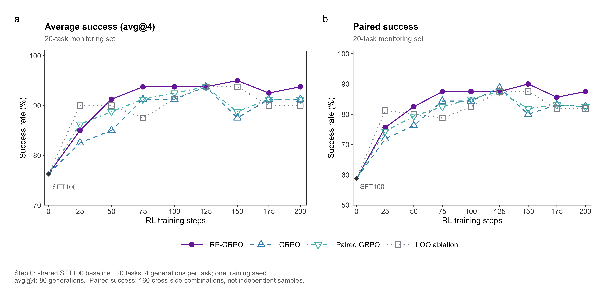</a><br />
  <sub>20 题监测集 · 每题 4 次生成 · 原始评测点连线 · 点击查看原图</sub>
</p>

监测集上，RP-GRPO 在 75 步达到 **93.75%** 平均成功率，150 步达到 **95.00% / 90.00%** 平均／配对成功率。完整验证集单独评测，200 步结果如下：

| 方法 | 完整验证集平均成功率 | 完整验证集配对成功率 |
| :--- | ---: | ---: |
| 普通 GRPO | **91.89%** | **86.15%** |
| 配对 GRPO | 90.88% | 84.12% |
| LOO 消融 | 91.55% | 85.30% |
| RP-GRPO | 90.88% | 84.12% |

完整验证集含 74 个任务，每题生成 4 次。当前监测集优势尚未在完整集形成一致领先；SFT100 / SFT400 对照、任务分项与统计口径见[完整阶段记录](docs/stage-results.md)。

[主图 SVG](assets/training/first200-success-comparison.svg) · [主图 PDF](assets/training/first200-success-comparison.pdf) · [完整验证集对照](assets/training/full-validation-step200.png) · [RL 奖励与损失](assets/training/training-dynamics.png)

<details>
<summary>SFT 训练损失</summary>

<p align="center">
  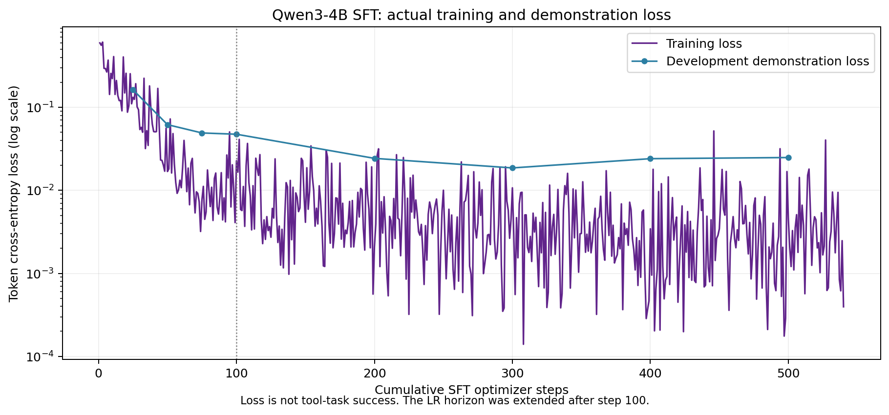<br />
  <sub>SFT 损失与 RL 评测分别记录；图中 100 步为 SFT 学习率计划调整。</sub>
</p>

</details>

后续补齐完整验证集检查点、多随机种子与 Hy3 接入对照。原始 Qwen 与 RP-GRPO step 200 最终 LoRA 已整理为独立发布包，网盘地址待补；Git 仅保存代码、图表与[权重加载说明](mito/models/README.md)。

## 知识图谱与机制发现

**从已有知识中提出候选关联，再通过推理与实验检验机制。** 在领域模型训练之外，我们将 RotatE 图谱表示学习接入科研推理：从实体与关系中预测待核实的新连接，由 Hy3 结合领域小模型的证据核验与条件约束，组织可检验的机制假设，再进入湿实验验证和证据反馈。

<p align="center">
  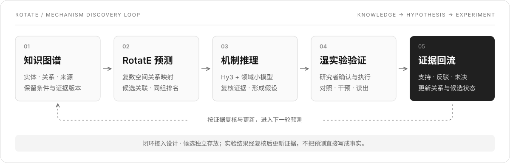
</p>

| 原图谱去重三元组 | RotatE 训练三元组 | 导出候选三元组 |
| :---: | :---: | :---: |
| **2,234** | **379** | **732** |

[RotatE（ICLR 2019）](https://arxiv.org/abs/1902.10197)将实体映射到复数向量空间，以关系旋转对缺失连接排序。随后核对来源、实验条件、支持与反向证据，形成可区分不同解释的假设；由研究者确认对照、干预和测量方案，开展湿实验。实验的**支持、反驳或未决结果**连同来源和条件回流，经复核更新关系与候选状态，为下一轮预测提供依据。

语言小模型训练与图谱表示学习分别进行，在推理与实验层衔接。当前已导出 **732 条候选**，工作台已展示原文定位、机制焦点、实验记录和方案草稿。后续将候选与对应湿实验逐项关联，接续验证结果与图谱反馈；候选数量不等于已验证的新机制。数据口径与预测质量见[机制发现策略](docs/mechanism-discovery.md)。

## 实际场景与落地

训练后的领域能力面向线粒体科研工作台：**显微成像 → 表型解析 → 文献与机制 → 实验规划 → 湿实验反馈**。

<p align="center">
  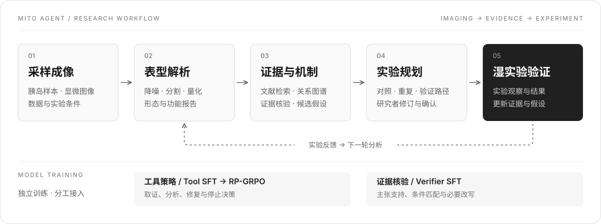
</p>

| 胰岛样本 | 线粒体分析 |
| :---: | :---: |
| **378** | **约 12.7 万** |

以上为项目材料中的应用规模。工作台展示与小模型训练成绩分别记录，训练模块不等于已完成全部线上接入。

### 01 · 线粒体表型解析

自研成像体系结合结构盲点自监督降噪、融合形态先验的弱监督分割，以及形态和功能分析。

<table>
  <tr>
    <td width="50%" valign="top">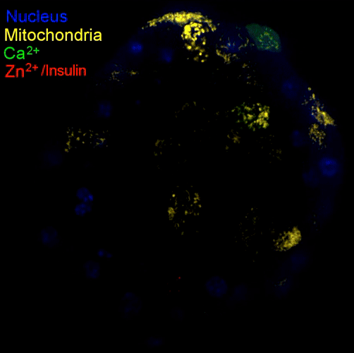</td>
    <td width="50%" valign="top" align="center">
      <br />
      <sub>成像设备与采集过程</sub><br /><br />
      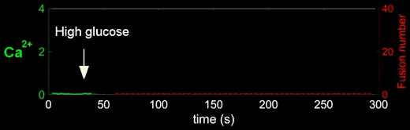
    </td>
  </tr>
  <tr>
    <td align="center"><sub>多通道胰岛成像</sub></td>
    <td align="center"><sub>钙信号与分泌事件</sub></td>
  </tr>
</table>

<table>
  <tr>
    <td width="50%" valign="top">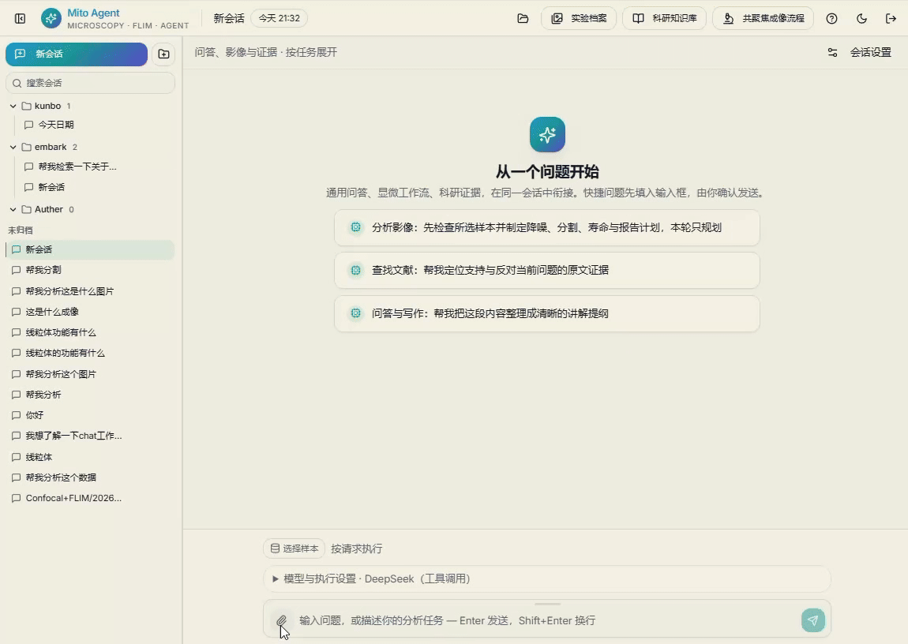</td>
    <td width="50%" valign="top"></td>
  </tr>
  <tr>
    <td align="center"><sub>图像检查与分割工作流</sub></td>
    <td align="center"><sub>原图分割与降噪后分割对比</sub></td>
  </tr>
</table>

<p align="center">
  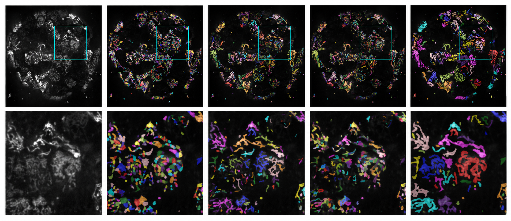<br />
  <sub>从左至右：原图、MoDL（<em>Nat. Commun.</em> 2025）、Nellie（<em>Nat. Methods</em> 2025）、Omnipose（<em>Nat. Methods</em> 2022）、自研算法。<br />下排为对应区域的局部放大。</sub>
</p>

现有权重／默认流程从细胞或亚细胞场景直接迁移至我们的胰岛成像时，尺度与成像差异可能降低识别效果，并非原方法本身较差。胰岛内千级线粒体精细标注困难，自研方法侧重降低标注依赖、提升该场景适配性。

### 02 · 文献知识与机制探索

<p align="center">
  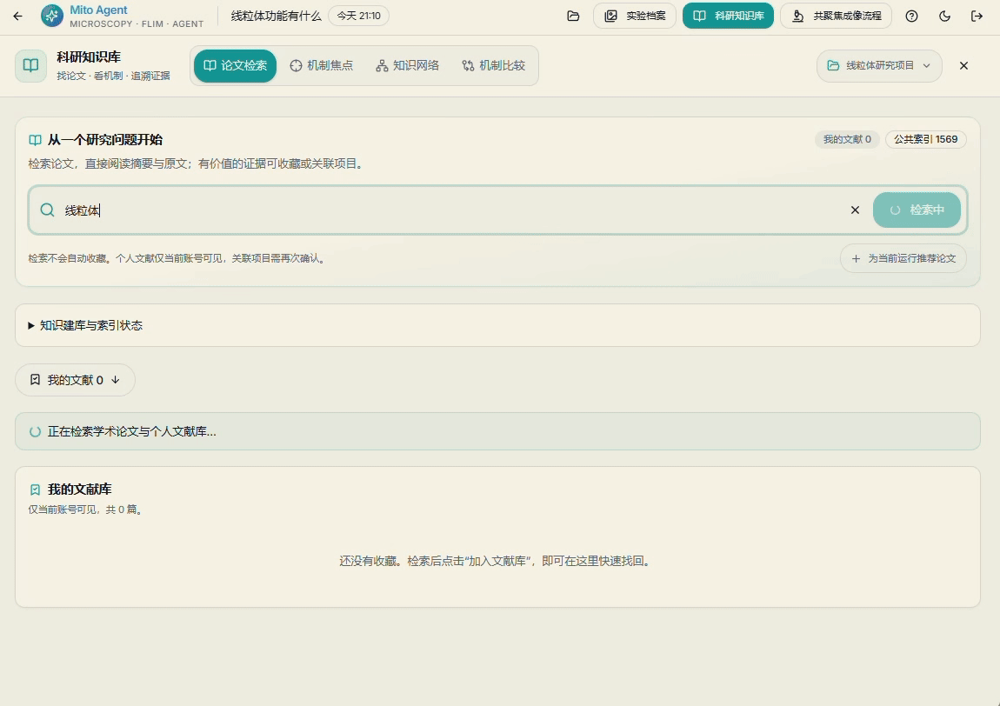<br />
  <sub>文献检索 · 来源查看 · 辅助阅读</sub>
</p>

工作台将文献检索、图谱关系和大小模型协同组织到同一研究上下文，承接[机制发现闭环](#知识图谱与机制发现)中的候选查看、证据复核与假设讨论。

<table>
  <tr>
    <td width="50%">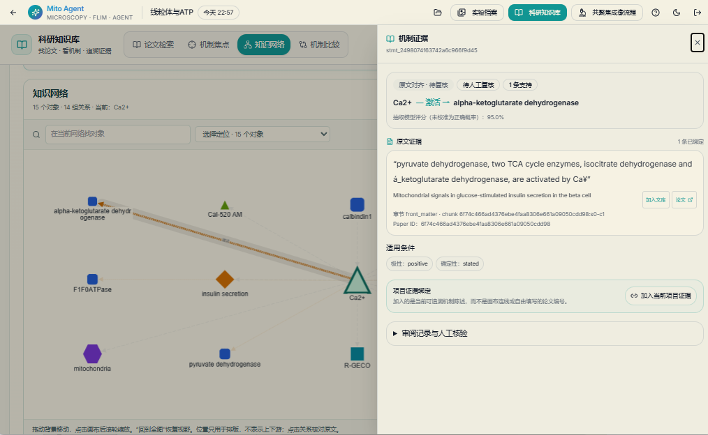</td>
    <td width="50%">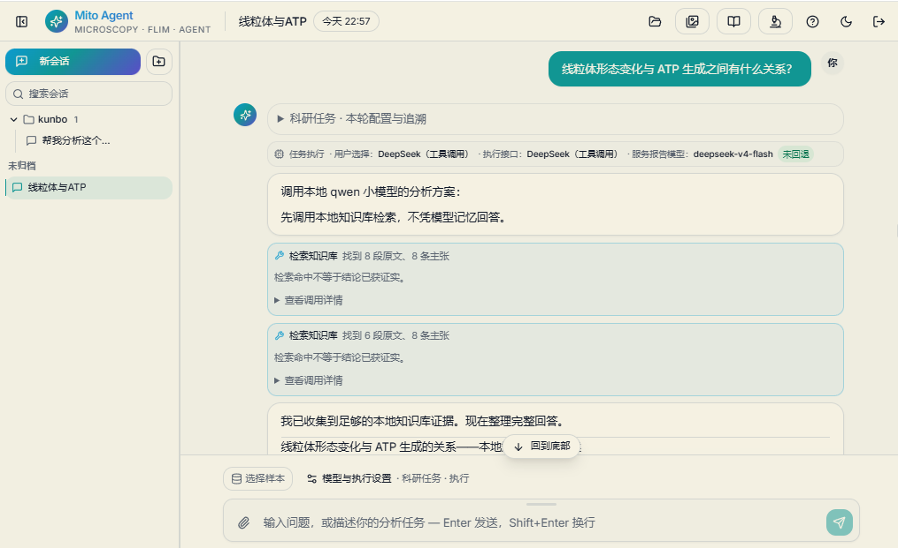</td>
  </tr>
  <tr>
    <td align="center"><sub>知识图谱与证据定位</sub></td>
    <td align="center"><sub>大小模型协同分析</sub></td>
  </tr>
</table>

<p align="center">
  <a href="assets/showcase/mechanism-hypotheses.png">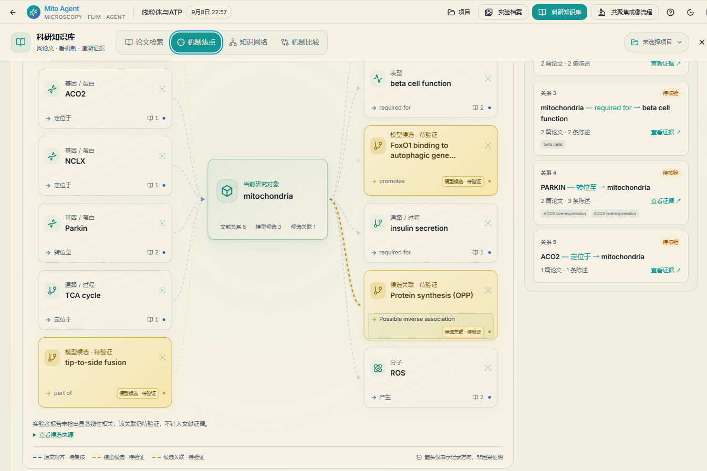</a><br />
  <sub>基于知识图谱训练的模型预测潜在实体关系，辅助下一轮实验设计，形成科研闭环。</sub>
</p>

**从候选连接走向机制问题。** 例如，RotatE 输出“线粒体 → 促进 → FoxO1 与自噬基因启动子的结合”，供模型追查支持证据、适用条件与反向解释，再组织可检验的假设。界面中的 OPP／蛋白合成关联另属人工假设，与模型候选分别记录。

### 03 · 实验规划与数字人协同

围绕研究假设组织对照、独立重复与验证路径；研究者确认方案、执行实验，将观察结果带回下一轮分析。现有工作台已展示实验观察记录与新方案草稿，可衔接“已有观察 → 待检验问题 → 下一轮实验”；草稿与执行结果分开保存。

<p align="center">
  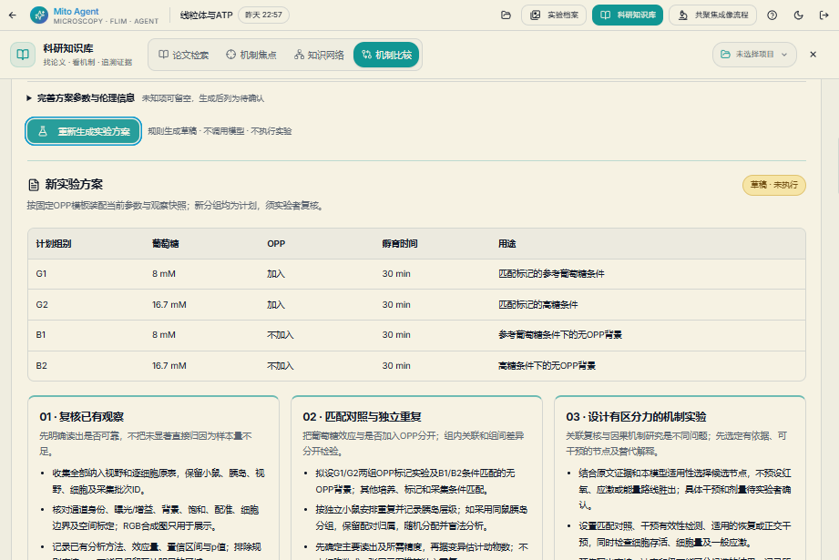<br />
  <sub>实验方案与验证路径</sub>
</p>

<table>
  <tr>
    <td width="50%" valign="top">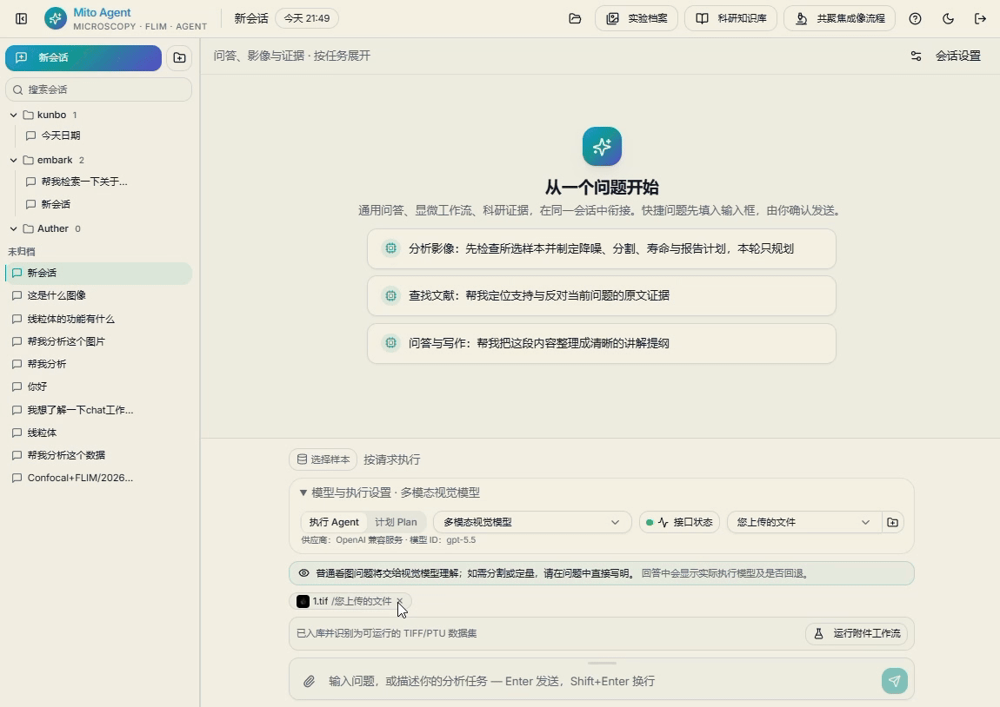</td>
    <td width="50%" valign="top"></td>
  </tr>
  <tr>
    <td align="center"><sub>多模态科研交互</sub></td>
    <td align="center"><sub>数字人实验协同 · 语音与视觉交互</sub></td>
  </tr>
</table>

更多场景与全部原始素材见[完整展示](assets/showcase/README.md)。

## 代码与数据

```text
hy-agent/
├── mito/                    # 核验 SFT、工具 SFT、GRPO / RP-GRPO
│   ├── code/                # 核验训练、对比与数据导出
│   ├── rp_grpo/             # 工具环境、策略训练与评测
│   ├── data/                # 已公开的核验标注；工具数据另行装配
│   ├── models/              # 基座及后续权重接入说明
│   └── tests/               # 算法、数据与流程测试
├── assets/                  # 训练路线、损失图与原始展示素材
├── docs/                    # 方法、标注流程与阶段记录
└── annotation_prelabel/     # 标注样例
```

```bash
git clone https://github.com/blues-kun/hy-agent.git
cd hy-agent/mito
python -m pip install -r requirements-test.txt
python -m pytest -q
```

上述入口只执行公共 CPU 测试，不启动训练。GPU 训练与完整快照评测见[训练指南](mito/README.md)。Git 仓库包含训练实现、标注数据与展示素材；原始 Qwen 与最终策略权重单独分发，旧适配器、优化器续训状态和内部数据不进入公开推理包。

[核验标注](mito/data/README.md) · [标注样例](annotation_prelabel/README.md) · [完整方法与配置](docs/training-and-evaluation.md) · [最终权重接入](mito/models/README.md) · [版本记录](docs/migration-20260910.md)

---

<p align="center"><sub>MITO Agent · Domain Training · Expert Feedback · Research Applications</sub></p>

完整项目地址：[MITO Agent](https://agent.blueskun.com:8444/) · 测试账号：`admin` · 测试密码：`123456`

源码获取与合作联系：[blues924@outlook.com](mailto:blues924@outlook.com) · 微信：**18299228189**。
