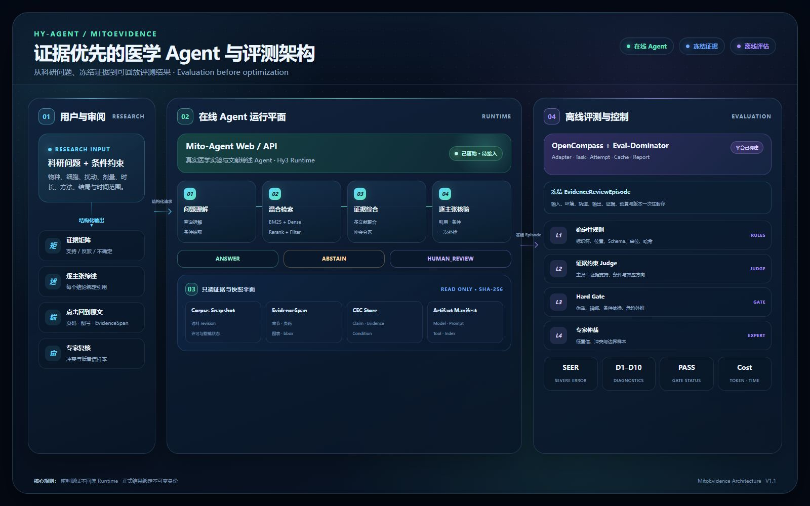
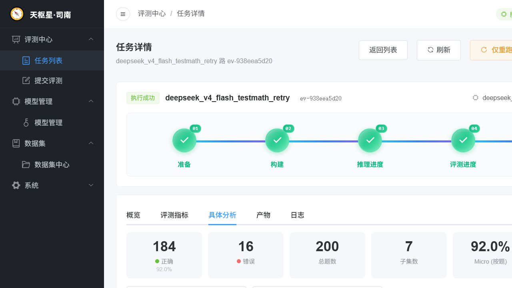

# Hy-Agent · MitoEvidence

### 面向 β 细胞线粒体研究的可追溯证据综述与评测方案

  <a href="#1-项目简介">项目简介</a> ·
  <a href="#2-总体架构">总体架构</a> ·
  <a href="#4-评测方法">评测方法</a> ·
  <a href="#5-平台与接入">平台与接入</a> ·
  <a href="#7-十二天计划">十二天计划</a>

---

## 1. 项目简介

MitoEvidence 包含两部分：面向医学实验与文献综述的 **Mito-Agent**，以及独立的 **MitoEvidence-Eval** 评测方法。项目聚焦 β 细胞线粒体研究，把科研问题转化为带原文锚点、实验条件和审核状态的证据综述。

> **医学 Agent 回答得像专家，不等于证据可信。结论必须能回到原文，实验条件必须可核验，严重错误必须能被独立评测。**

| 组成 | 状态 | 本期工作 |
|---|---|---|
| Mito-Agent | ● 已部署 · 待接入 | 机器接口、Trace、适配器 |
| 离线评测平台 | ● 已构建 | 模型、数据、任务与报告 |
| MitoEvidence-Eval | ◐ 实现中 | CEC、数据集、四层评测器 |

## 2. 总体架构

  

五步主流程与可信证据、离线评测两层支撑能力

设计遵循四条规则：

1. **证据优先**：最小可信单元是 `Claim + EvidenceSpan + Condition`，而不是孤立答案。
2. **评估优先**：先验证评估器的判别力和一致性，再比较 Agent 版本。
3. **显式决策**：拒答和人工复核是正式结果，不视为系统失败。
4. **测试隔离**：开发集诊断可以回流；密封测试的答案、证据和反馈禁止回流。

## 3. 重点技术

| 模块 | 核心作用 | 输出 |
|---|---|---|
| 科研问题结构化 | 抽取物种、细胞、扰动、剂量、时长与结局 | 条件化问题 |
| EvidenceSpan | 定位章节、页码、图表与原文片段 | 原文证据锚 |
| CEC | 绑定主张、证据和实验条件 | 可审核证据单元 |
| 混合检索 | BM25 + Dense + Rerank + 条件过滤 | 候选证据与排序 |
| 逐主张核验 | 核对引用、条件、效应方向和冲突 | 通过、拒答或转专家 |
| EvidenceReviewEpisode | 冻结输入、轨迹、输出、证据和版本 | 可回放记录 |
| 四层评测器 | L1 规则 → L2 证据 Judge → L3 Hard Gate → L4 专家 | 分数、门禁和失败原因 |

本期聚焦上述主链路；证据图、KGE、GRPO 与图像语义理解留作后续。

## 4. 评测方法

### 4.1 三条评测轨道

| 轨道 | 评测对象 | 输出 |
|---|---|---|
| 基础能力回归 | Hy3 或其他底座模型 | 六类能力画像，不合成医学总分 |
| 医学 Agent 评测 | Mito-Agent 的不同系统版本 | SEER、D1–D10、Gate、成本 |
| 评估器元评估 | MitoEvidence-Eval | 判别力、人工一致性、稳定性和攻击检出 |

### 4.2 六类基础能力

| 能力 | 代表性任务 |
|---|---|
| 通用知识 | 跨领域知识理解与事实判断 |
| 数学与理工科 | 数学推导、物理、化学与工程问题 |
| 多语言 | 医学英语、中文医学表达与跨语言一致性 |
| 代码 | 通用代码，以及线粒体图像分割原理判断与底核方法设计 |
| 推理 | 跨论文证据链、冲突分析、机制与因果层级 |
| 上下文 | 长论文、多文献证据池与中间位置证据召回 |

公共 Benchmark 只用于底座回归，不能替代医学场景评测。

### 4.3 医学 Agent 评测

两套样本严格隔离：

| 数据集 | 用途 | 初始规模 |
|---|---|---:|
| MedicalQuestionSet | 比较 Agent 系统版本 | Pilot 100 题：40 开发 + 60 密封 |
| EvaluatorChallengeSet | 验证评估器是否识别受控错误 | 不少于 60 个变形家族 |

系统按单因素递增比较：

`S0 直接生成 → S1 Dense RAG → S2 混合检索 → S3 条件过滤 → S4 逐主张核验 + 一次补检 + 拒答`

本期主比较为 `S4 vs S2`。评估器必须先完成元评估并冻结，再运行密封测试。

**主指标**

~~~text
SEER = 含严重证据错误的关键输出主张数 / 可评估关键输出主张数
~~~

`D1–D10` 用于诊断任务覆盖、来源追溯、证据支持、引用完整、条件保真、冲突覆盖、推断与拒答、术语、复现和科研可用性。十维总分不能抵消 Hard Gate。

**Hard Gate**

以下情况直接进入 `FAIL` 或人工复核：

- 伪造、错绑或不可定位的关键引用；
- 核心结论无证据，或被所引原文直接反驳；
- 物种、细胞模型、实验条件或效应方向偷换；
- 把相关性写成因果，或从基础实验无支持地外推临床建议；
- 证据不足却继续强答。

最终状态为 `PASS / REVIEW / FAIL`，阈值在开发集校准后冻结。

## 5. 平台与接入

现有离线平台已提供模型、数据、任务、产物、日志和报告工作流。本期在现有平台中新增 Mito-Agent 接入与医学证据评测能力。

  

已构建离线评测平台的任务详情与题级分析界面

接入主链路：

`QuestionSet → MitoAgentAdapter → Mito-Agent → EvidenceReviewEpisode → L1–L4 → Eval-Dominator Report`

| 接入项 | 内容 |
|---|---|
| Agent 适配 | 稳定机器接口、脱敏鉴权、超时与失败保留 |
| Trace 统一 | 检索、重排、工具调用、补检、Token、延迟和产物引用 |
| 身份冻结 | 模型、Prompt、语料、索引、工具、Runner、评估器和 seed |
| 报告扩展 | SEER、D1–D10、Gate、成本、题级错误和专家队列 |

[Mito-Agent 在线实例](https://agent.blueskun.com:8444/)已部署，当前等待机器接口与 Trace 接入。

## 6. 预期效果

| 目标 | 验证方式 |
|---|---|
| 降低严重证据错误 | 比较 S4 与 S2 的 SEER 和 Hard Gate |
| 提高证据支持与条件保真 | 检查关键主张、引用和实验条件的一致性 |
| 提高正确拒答与风险分流 | 单独报告 ANSWER、ABSTAIN、HUMAN_REVIEW |
| 验证评估方法有效 | 检查判别力、专家一致性、重复稳定性和攻击检出 |
| 保证结果可复现 | 每项结果可回到 Episode、配置、快照和版本身份 |
| 提高科研核对效率 | 实测定位一条支持或反驳证据所需时间 |

## 7. 十二天计划

依托已构建的评测平台和已部署的 Mito-Agent，本阶段采用 12 天冲刺，优先完成可调用、可回放、可评测的最小闭环。

| 时间 | 目标 | 交付 |
|---|---|---|
| 第 1–2 天 | 冻结范围并接入 Agent | Scope、接口契约、单题调用和脱敏日志 |
| 第 3–4 天 | 统一 Trace，完成六类能力 smoke | Episode v1、基础能力快照 |
| 第 5–6 天 | 建立证据底座并运行系统基线 | EvidenceSpan、CEC、S0–S3 结果 |
| 第 7–8 天 | 实现评估器并构建挑战集 | D1–D10、SEER、L1–L3、ChallengeSet |
| 第 9–10 天 | 元评估冻结，完成 S4 | 校准记录、四层评测器、完整闭环 |
| 第 11–12 天 | 密封小测、结果整理和发布 | 失败归因、报告、复现入口和 README |

---

  <strong>Ground every claim. Trace every source. Evaluate every failure.</strong>

