# MITO Agent · 功能图库

[返回项目首页](../../README.md)

收录项目展示材料中的全部 26 份现存媒体：17 张 PNG、9 个 GIF。文件保留原始字节、分辨率与动画时序，仅统一为英文文件名；点击图片可查看原件。

## 图像分析与报告

样本上传、图像检查与分割候选结果。

原图与处理结果的交互比较。

分割比较图从左至右：原图、MoDL、Nellie、Omnipose、自研算法；下排对应局部放大。

| 降噪比较素材 01 | 降噪比较素材 02 | 降噪比较素材 03 |
| --- | --- | --- |
| 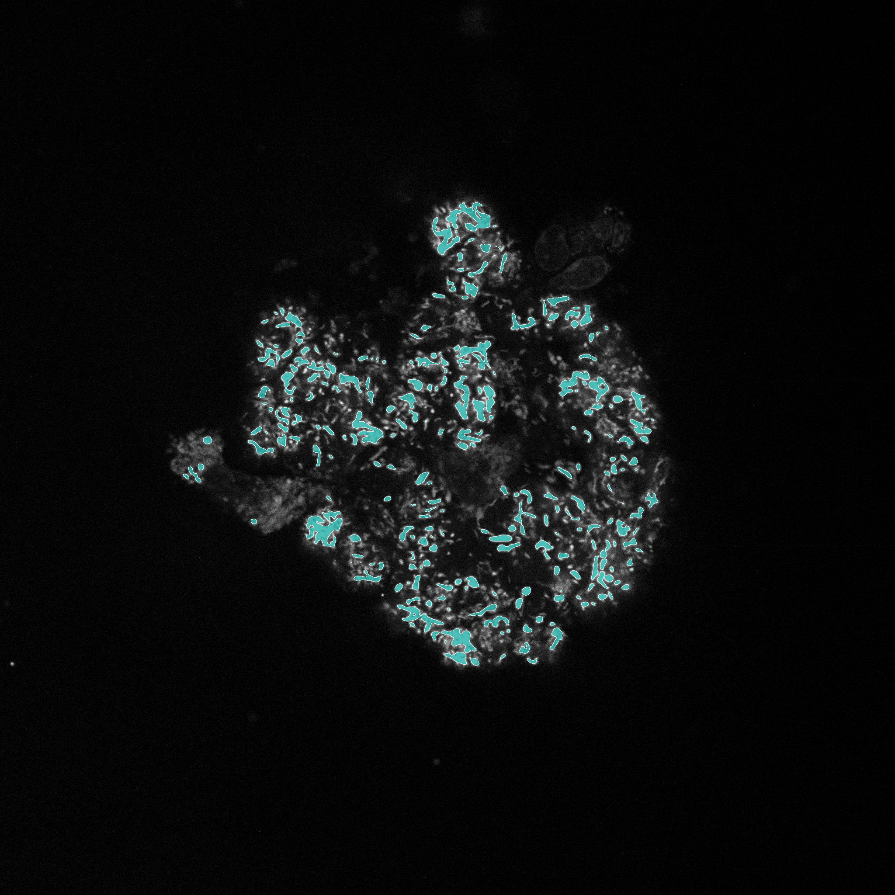 | 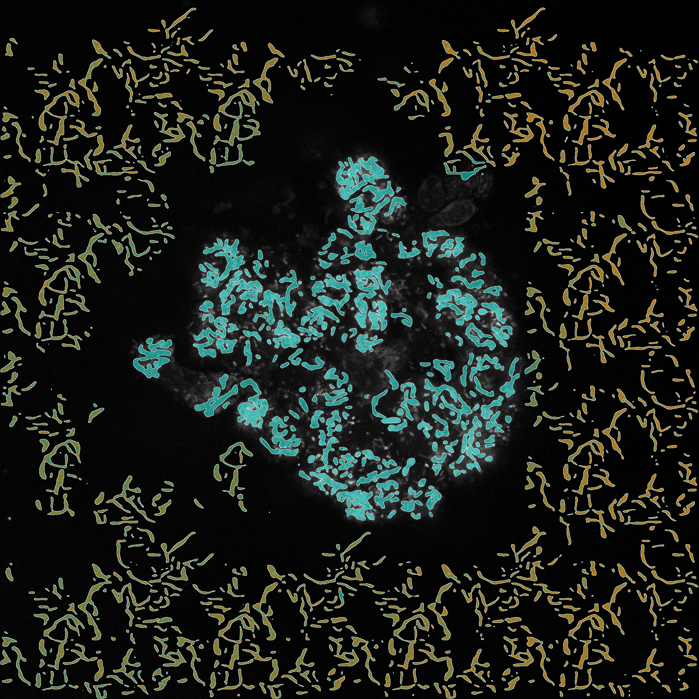 | 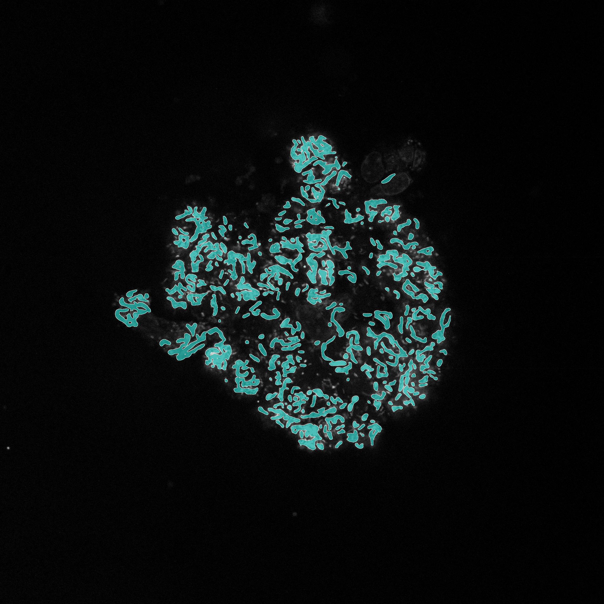 |

| 报告概览与方法 | FLIM 功能量化 | 质量审查与文献 |
| --- | --- | --- |
| 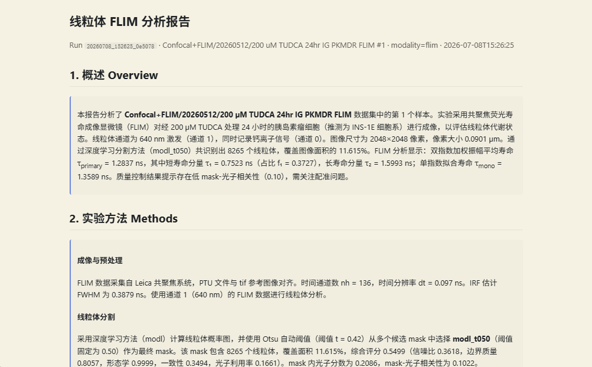 | 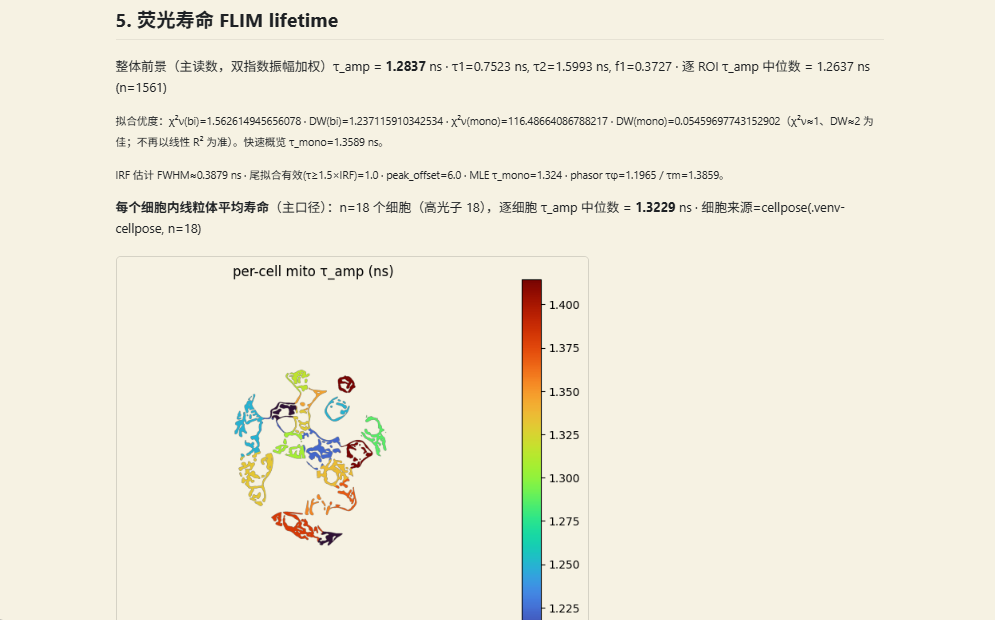 | 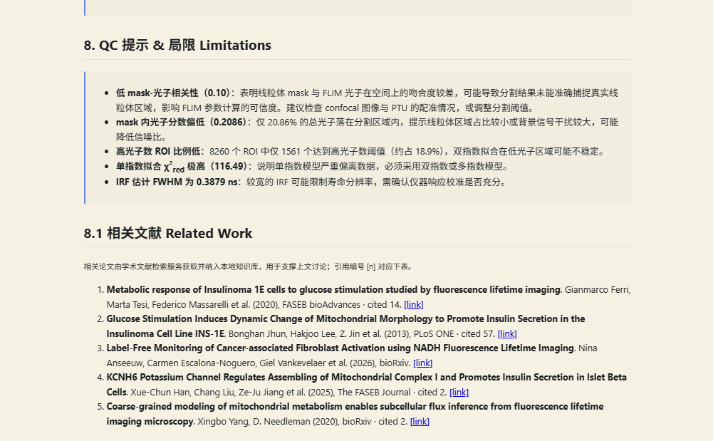 |

## 文献知识与实验规划

文献检索、来源查看与辅助阅读。

| 知识网络与原文证据 | 大小模型协同对话 |
| --- | --- |
|  |  |

候选机制与文献证据的关联展示。

| 实验观察记录 | 基于证据与规则的实验规划 |
| --- | --- |
| 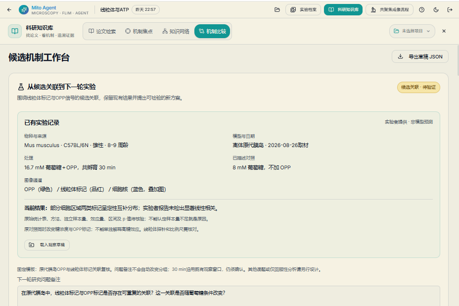 |  |

OPP 荧光、线粒体荧光及细胞核融合图。

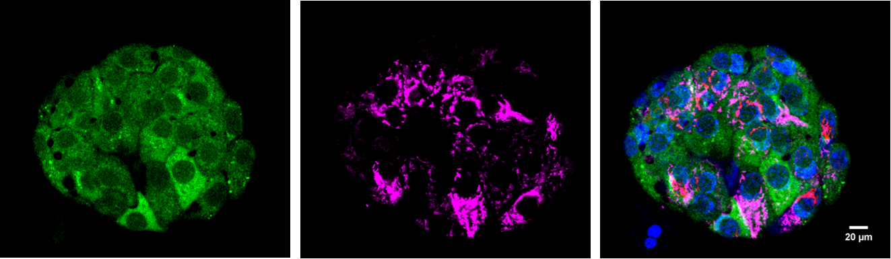

## 数字人实验协同

实验现场的数字人、摄像头画面与多模态交流。

## 通用科研交互

| 知识问答 | 多模态交互 |
| --- | --- |
| 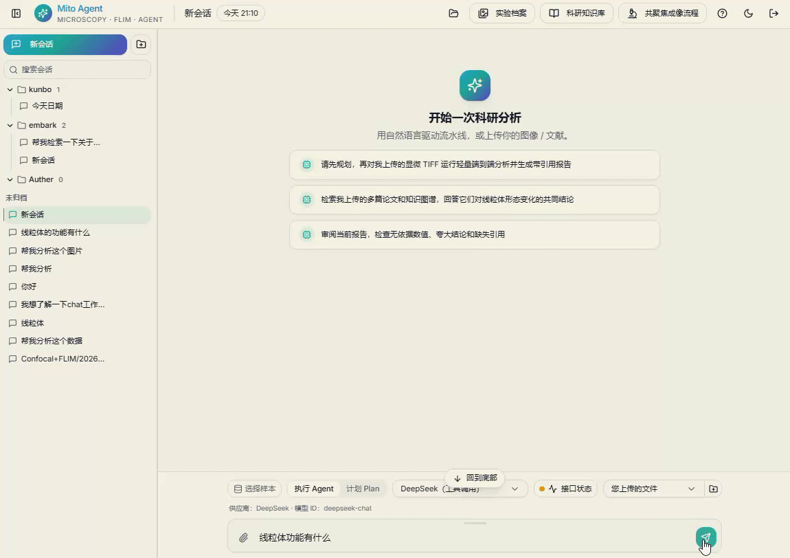 |  |

## 成像与研究背景

| 多通道胰岛成像 | 实际成像系统 |
| --- | --- |
|  |  |

研究背景与协同思路

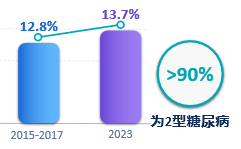

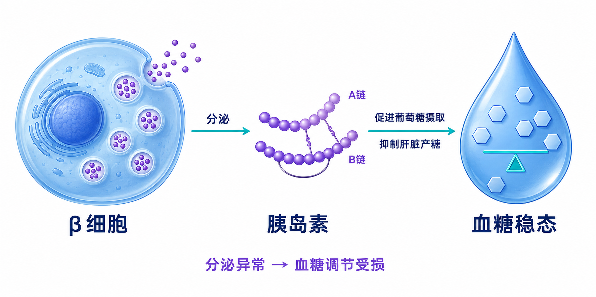

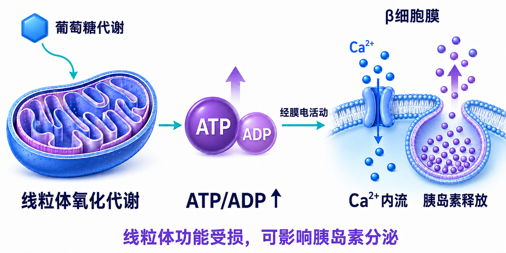

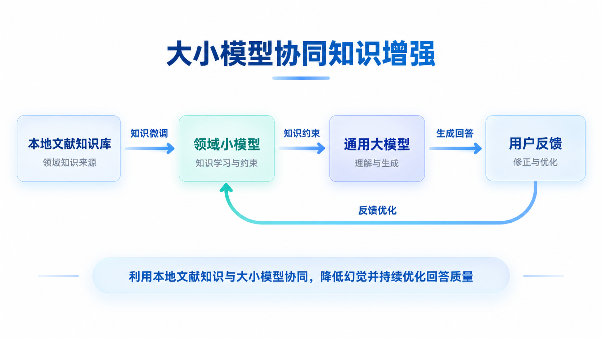

## 来源索引

来源页码与原文件名对应项目演示材料的逐页媒体提取记录；图片中的内容与标注保持原样。

| 来源页 | 原文件名 | 仓库文件 | 内容 |
| --- | --- | --- | --- |
| 1 | `1_image_02.png` | [diabetes-background.png](diabetes-background.png) | 糖尿病研究背景 |
| 1 | `1_image_03.png` | [beta-cell-insulin.png](beta-cell-insulin.png) | β细胞与胰岛素分泌 |
| 1 | `1_image_04.png` | [mitochondrial-metabolism.png](mitochondrial-metabolism.png) | 线粒体代谢与分泌 |
| 2 | `2_gif_01.gif` | [islet-multichannel.gif](islet-multichannel.gif) | 多通道胰岛成像 |
| 2 | `2_gif_02.gif` | [imaging-system.gif](imaging-system.gif) | 成像设备 |
| 2 | `2_gif_03.gif` | [calcium-secretion.gif](calcium-secretion.gif) | 钙信号与分泌事件 |
| 3 | `3_gif_01.gif` | [knowledge-assistant.gif](knowledge-assistant.gif) | 知识问答 |
| 3 | `3_gif_02.gif` | [multimodal-assistant.gif](multimodal-assistant.gif) | 多模态交互 |
| 3 | `3_gif_03.gif` | [literature-search.gif](literature-search.gif) | 文献检索与阅读 |
| 4 | `4_gif.gif` | [image-analysis.gif](image-analysis.gif) | 图像检查与分割 |
| 5 | `5_gif.gif` | [denoising-interaction.gif](denoising-interaction.gif) | 处理结果交互比较 |
| 5 | `5_image_02.png` | [denoising-comparison-01.png](denoising-comparison-01.png) | 降噪比较素材 01 |
| 5 | `5_image_03.png` | [denoising-comparison-02.png](denoising-comparison-02.png) | 降噪比较素材 02 |
| 5 | `5_image_04.png` | [denoising-comparison-03.png](denoising-comparison-03.png) | 降噪比较素材 03 |
| 6 | `6_image_02.png` | [segmentation-comparison.png](segmentation-comparison.png) | 分割方法比较 |
| 8 | `8_image_02.png` | [analysis-report.png](analysis-report.png) | 报告概览与方法 |
| 8 | `8_image_03.png` | [quantitative-report.png](quantitative-report.png) | FLIM 功能量化 |
| 8 | `8_image_04.png` | [report-quality-review.png](report-quality-review.png) | 质量审查与文献 |
| 9 | `9_gif.gif` | [digital-human.gif](digital-human.gif) | 数字人实验协同 |
| 10 | `10_image_02.png` | [knowledge-collaboration-concept.png](knowledge-collaboration-concept.png) | 大小模型知识增强思路 |
| 11 | `11_image_02.png` | [knowledge-graph.png](knowledge-graph.png) | 知识网络与原文证据 |
| 11 | `11_image_03.png` | [model-collaboration.png](model-collaboration.png) | 大小模型协同对话 |
| 12 | `12_image_02.png` | [mechanism-hypotheses.png](mechanism-hypotheses.png) | 候选机制关联 |
| 12 | `12_image_03.png` | [wet-lab-imaging.png](wet-lab-imaging.png) | 湿实验成像 |
| 13 | `13_image_02.png` | [experimental-observation.png](experimental-observation.png) | 实验观察记录 |
| 13 | `13_image_03.png` | [experiment-planning.png](experiment-planning.png) | 实验辅助规划 |
