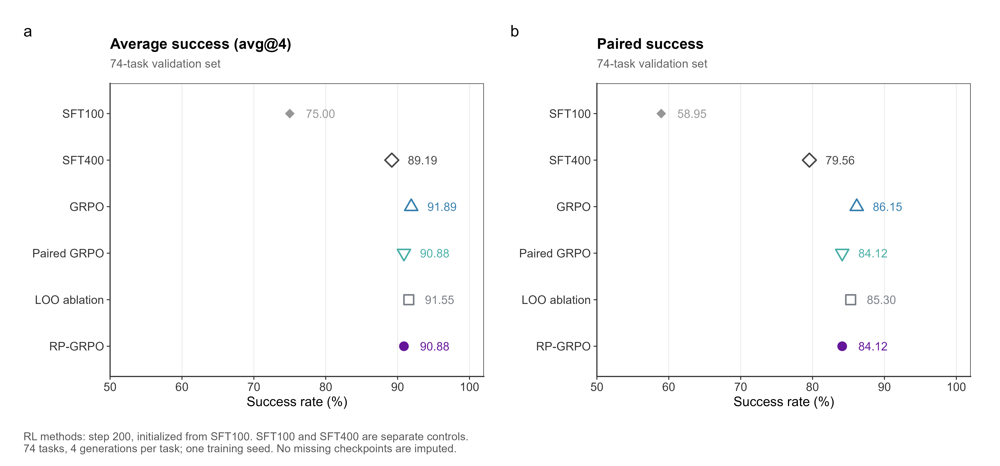
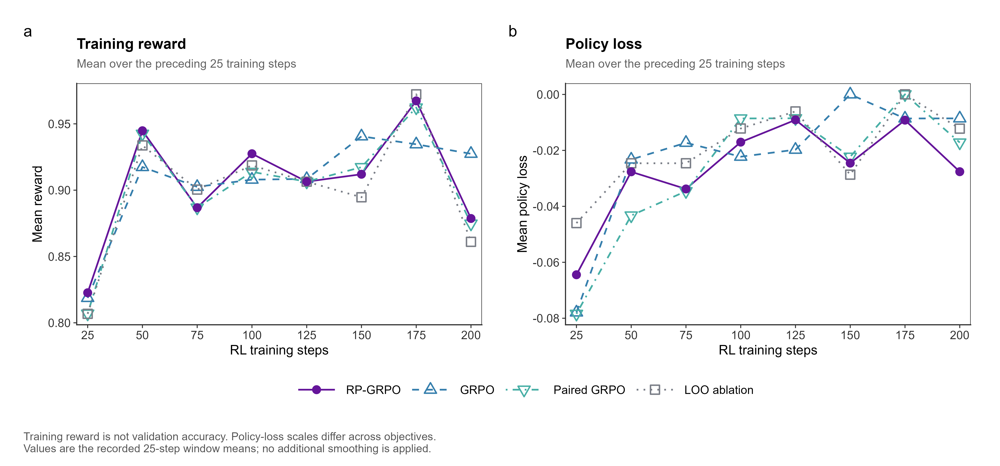

# 小模型训练 · 阶段记录

核验 SFT 与工具策略分别管理。本轮工具训练链路为 **Qwen3-4B → 旧工具 SFT → 本轮 SFT100 → 四组 RL（B1 / B2 / LOO / B3）**；SFT400 单列为训练时长对照，不是当前 RL 的初始化起点。当前展示前 200 步的实际记录，历史阶段汇总另行保留。

## 前 200 步：监测集曲线

四组各有 25、50、75、100、125、150、175、200 步八个观测。0 步为同一个 SFT100 基线，并非四次独立基线测量。横轴是 RL 采样循环数；本次记录中的参数更新数与其一致，不能称为完整遍历训练集的 epoch。

| 200 步方法 | avg@4 | 双侧配对 | 文本成功 | 数值成功 |
| :--- | ---: | ---: | ---: | ---: |
| RP-GRPO | 93.75% | 87.50% | 62/64 | 13/16 |
| 普通 GRPO | 91.25% | 82.50% | 62/64 | 11/16 |
| 配对 GRPO | 91.25% | 82.50% | 62/64 | 11/16 |
| LOO 消融 | 90.00% | 81.88% | 62/64 | 10/16 |

按展示标签，RP-GRPO 在 75 步达到 93.75% 平均成功率，150 步为本轮监测峰值 95.00% / 90.00%，200 步回到 93.75% / 87.50%。这描述本次监测曲线，不代表跨种子稳定性或训练越久越好。

## 完整验证集与 SFT 对照

| 方法 | avg@4 | 双侧配对 | 文本成功 | 数值成功 |
| :--- | ---: | ---: | ---: | ---: |
| SFT100 | 75.00% | 58.95% | 215/280 | 7/16 |
| SFT400 | 89.19% | 79.56% | 248/280 | 16/16 |
| 普通 GRPO · 200 步 | 91.89% | 86.15% | 261/280 | 11/16 |
| 配对 GRPO · 200 步 | 90.88% | 84.12% | 261/280 | 8/16 |
| LOO 消融 · 200 步 | 91.55% | 85.30% | 262/280 | 9/16 |
| RP-GRPO · 200 步 | 90.88% | 84.12% | 261/280 | 8/16 |

完整集已有 9/32 个计划检查点结果；此处只比较四组均已完成的 200 步。RP-GRPO 相对 SFT100 平均成功率提高 15.88 个百分点，相对 SFT400 高 1.69 个百分点；尚未超过普通 GRPO。SFT400 与 RL 在文本和数值任务上的表现不同，不能只凭总分判断所有能力均改善。

### 指标定义

| 项目 | 20 题监测集 | 74 题完整验证集 |
| :--- | :--- | :--- |
| avg@4 | 80 条生成中成功的比例 | 296 条生成中成功的比例 |
| pass@4 | 20 个任务中至少一次成功的比例 | 74 个任务中至少一次成功的比例 |
| 双侧配对 | 10 对任务 × 16 种跨侧组合 | 37 对任务 × 16 种跨侧组合 |
| 文本 / 数值生成 | 64 / 16 | 280 / 16 |

每题生成 4 次，每对任务统计两侧 4×4 种组合中双侧均成功的比例。组合不等于独立样本；`cons@4` 未计算，空白不当作零。监测与完整验证来自不同评测运行，即使任务有重叠，也不能拼接曲线或混用生成结果。

## RL 训练动态

图中为日志记录的此前 25 步窗口均值，未再平滑。训练 reward 不等于验证成功率；策略损失保留正负号，不同目标和优势归一化的 loss 绝对值不能直接排名。独立 KL 与 clip fraction 未记录，不补造。全部图采用同一组颜色与点形，提供同名 SVG / PDF。

## 数据来源与已知问题

- 来源为项目提供的前 200 步结果工作簿，文件 SHA-256：`1640810b60e277888bf41a89a7ed2c3f45dc68a7b7f50b4c1ae595a2cf58aefc`。作图未更改工作簿。
- 根据项目指定，监测图使用 Excel 展示页的模型标签。该页 B1/B3 与“评测原始字段”的归属相反：例如 25 步的 85.00% 在展示页归于 B3，原始字段归于 B1。当前记录保留此冲突，来源选择不等于已修复身份问题；完整集 200 步部分与原始字段一致。
- 本轮仅一个训练种子，评测种子为 `20260910`，且固定验证集反复观察；不报告未经检验的显著性或独立测试结论。
- 原工作簿记录评分器对部分否定句存在误判；未提供量化影响，图表沿用原分数。
- 历史“约 100 步”汇总与本轮精确检查点不自动绑定。

## 历史约 100 步：RP-GRPO 与普通 GRPO

下表保留项目负责人此前提供的约 100 步阶段汇总原值，不是本次文档更新重新运行训练得到的结果。

| 指标 | RP-GRPO | 普通 GRPO |
| :--- | ---: | ---: |
| 平均成功率 | 91.25% | 85.00% |
| 配对成功率 | 82.50% | 76.25% |
| 数值任务成功次数 | 13/16 | 7/16 |
| 文字任务成功次数 | 60/64 | 61/64 |

按两类成功次数加总，RP-GRPO 为 73/80、普通 GRPO 为 68/80，与所给平均成功率一致。平均与配对指标分别提高 6.25 个百分点；数值任务增加 6 次成功，文字任务减少 1 次。此处 80 是所给汇总的计数分母，不额外推断为 80 个独立问题族，也不直接套用到本轮 74 个验证任务；两者对应关系需由逐条记录确认。

该历史汇总未随附精确 checkpoint、数据分区、随机种子、重复次数、逐条输出、配对指标的统计定义和分母。配对成功率按原值展示，不反推出整数配对次数，也不据此给出显著性或最终泛化结论。当前也没有可附表的 PPO 数值结果。

## SFT 损失图

原图来自项目提供的 `loss.png`，保持原始图像不改写：紫线为训练损失，蓝线为验证集示范损失，横轴为累计 SFT 优化步数，纵轴为 token 交叉熵损失（对数刻度）。图中 100 步虚线表示 SFT 学习率计划延长，与上表“约 100 步 RL”不建立对应关系。

该图不用于表达 RP-GRPO 的训练损失、RL 成功率或 GRPO 对比。曲线下降描述示范拟合情况，实际工具任务质量由执行结果单独评估。

## 持续训练

继续训练时保留同一 SFT 起点、工具与奖励版本，补充更长训练曲线、多随机种子和独立任务结果。普通 GRPO、RP-GRPO 与 PPO 对照分别记录；PPO 的实验产物后续补充，不将现有 PPO 式裁剪实现等同于完整 PPO 基线。

最终 RP-GRPO step200 LoRA 已整理，网盘下载链接待补，参见[模型与权重说明](../mito/models/README.md)。后续补齐阶段表与代码提交、数据版本、适配器哈希、预算及逐条评测记录的绑定；权重单独分发，不纳入 Git。

→ [RP-GRPO 方法](../mito/rp_grpo/RP_METHOD.md) · [返回项目首页](../README.md)
